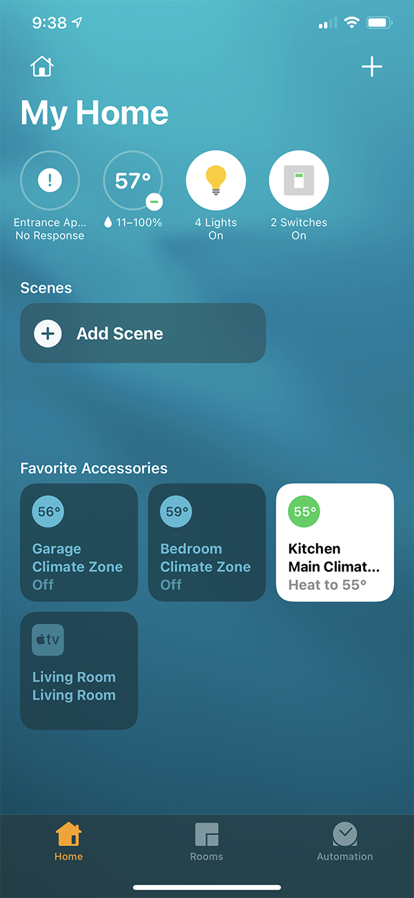
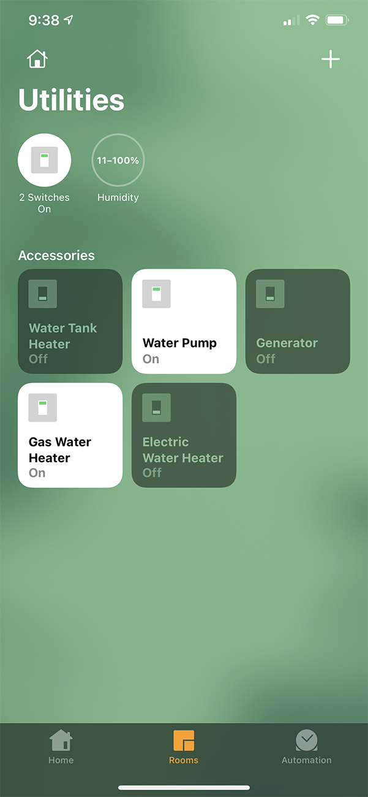
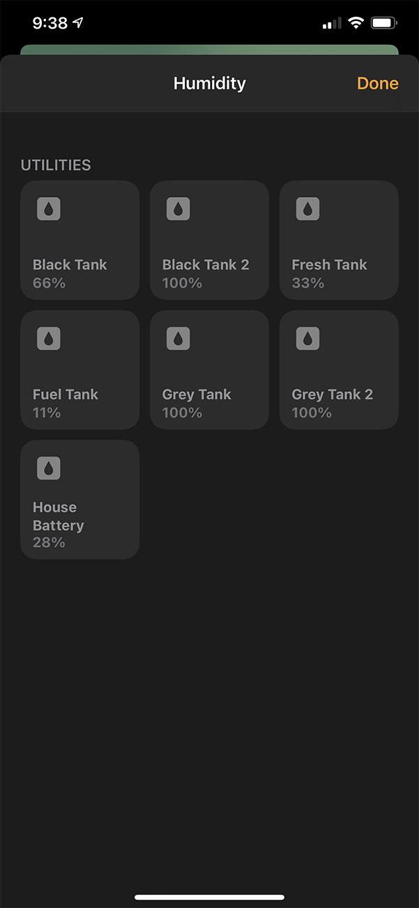

# rv-homekit

rv-homekit is a small GO app used to act as a proxy/adapter between the OneControl interface from LCI and Apple's HomeKit

It is designed to be able to run on a raspberry pi plugged into the ethernet port on the OneControl gateway and joined to 
your own WiFi network if they are separate.

  

## Installation

First you need to prepare a RaspberryPi as your host for the application. The OS that I'm using myself is [Ubuntu 20.04 server](https://ubuntu.com/download/raspberry-pi). You will need to use a RaspberryPi 3 or 4 and the 64 bit version of Ubuntu.

If you have a separate WiFi network that you use for your devices configure the wireless on the pi to connect to that network.

Download the rv-homekit app from https://github.com/jgulick48/rv-homekit/releases/download/v0.0.1/rv-homekit and save it in its own directory.

## Building

If you are building from the source code for a Raspberry Pi you will want to use the following command.

```
env GOOS=linux GOARCH=arm GOARM=5 go build
```

## Configuration

There are a few settings that need to be configured and saved in a config.json file in the same directory as the application.

The config file needs the following information:
* Bridge Name (This is what will show in homekit as your device name.)
* Bridge Pin (Must be 8 digits, this is the pin to add the bridge to HomeKit)
* OpenHAB host. (Should be http://192.168.1.4:8080)
* Port Number. (This can be any port but must be exposed to your network like below.)

Here's an example config.

```json
{
  "bridgeName": "My RV",
  "openHabServer": "http://192.168.1.4:8080",
  "pin": "00102003",
  "port": "12321"
}
```

# Running

## Using Shell

Initially running is done like a regular application. Enter the folder where you downloaded rv-homekit and created the config.json file and run `./rv-homekit`

If you wish to run this unattended use nohup to keep the application running after closing the ssh session.
`nohup ./rv-homekit`

## Using Docker

Make a directory for the application to store its configuration and item information. One example would be `/var/lib/rv-homekit`. Download the config.json file to this location using the following command `wget https://raw.githubusercontent.com/jgulick48/rv-homekit/master/config.json` This config file needs to be mounted as a volume in the container under `/var/lib/rv-homekit` If running on a raspberryPi use the arm release of the docker image. An example command is as follows:
```
docker run -d --volume /var/lib/rv-homekit/:/var/lib/rv-homekit/ -p 12321:12321 --network host jgulick48/rv-homekit:arm-latest
```
If you have a V.E. Direct serial cable hooked up to the unit add this as a device to the docker container.
```
docker run -d --volume /var/lib/rv-homekit/:/var/lib/rv-homekit/ --device /dev/ttyUSB0:/dev/ttyUSB0 -p 12321:12321 --network host jgulick48/rv-homekit:arm-latest
```
If you want to have the container run when the docker service starts up you can add `--restart unless-stopped` to the run command. This will make sure the container starts up again if it wasn't manually stopped. For information on how to get docker to start on boot see https://docs.docker.com/engine/install/linux-postinstall/#configure-docker-to-start-on-boot